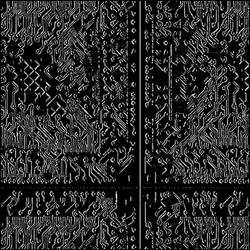

# INHA Univ. Parallel Image Processing Programming for Graduated Students EX9

## ./ex9

```
kana@Alienware:~/Documents/Class/Parallel image processing programming/ex9/build$ cmake .. && make && ./ex9
-- Found CUDA: /usr/local/cuda-11.4 (found suitable exact version "11.4")
-- Found CUDA: /usr/local/cuda-11.4 (found version "11.4")
-- Configuring done
-- Generating done
-- Build files have been written to: /home/kana/Documents/Class/Parallel image processing programming/ex9/build
Consolidate compiler generated dependencies of target ex9
[100%] Linking CXX executable ex9
[100%] Built target ex9
OpenCL Processing Time:  0.094507 msec
OpenCV Processing Time:  0.049884 msec
```

## Execute Result, Sobel Filter

<p align="center">
  <p>OpenCL</p>
  
  <p>OpenCV</p>
  
</p>
