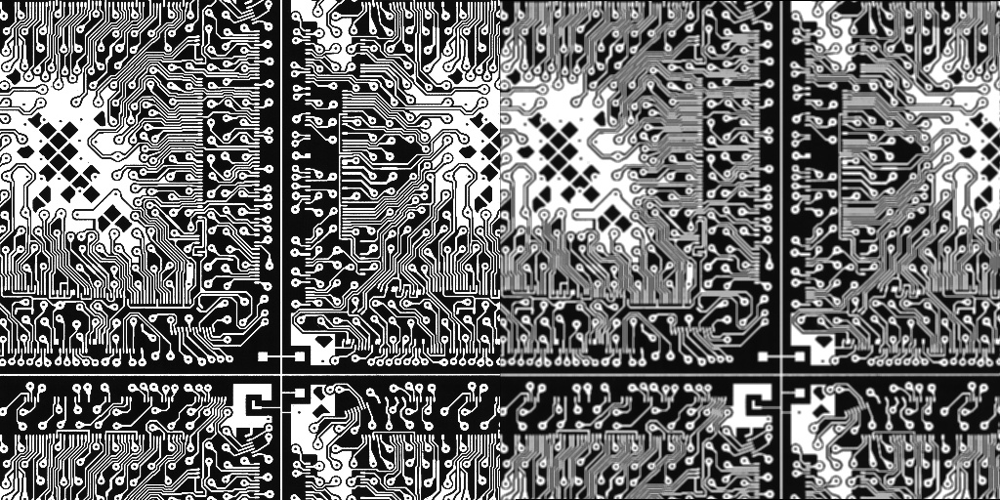

# INHA Univ. Parallel Image Processing Programming for Graduated Students HW5

# ./hw5

```
kana@Alienware:~/Documents/Class/Parallel image processing programming/hw5/build$ cmake .. && make && ./hw5
-- Configuring done
-- Generating done
-- Build files have been written to: /home/kana/Documents/Class/Parallel image processing programming/hw5/build
Consolidate compiler generated dependencies of target hw5
[100%] Built target hw5

Parallel Image Processing Programming HW5
22212231 김가나

Mean Filtering Using SSE & Compare with Serial
  |- Processing Time
     - Serial    : 0.000719 sec
     - SSE       : 0.00038 sec

```

<p align="center">
  
  
</p>
