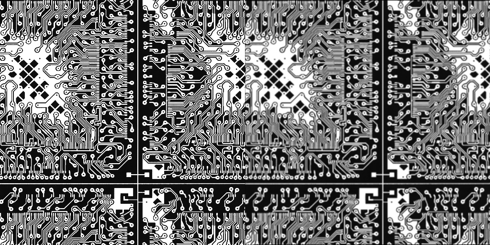
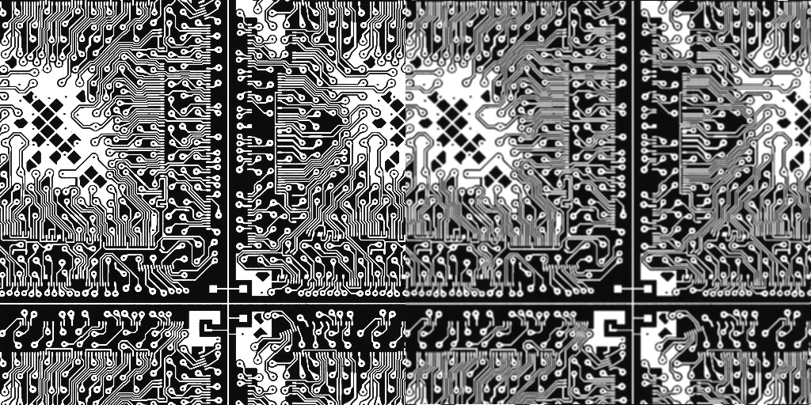

# INHA Univ. Parallel Image Processing Programming for Graduated Students HW6

## ./hw6

```
kana@Alienware:~/Documents/Class/Parallel image processing programming/hw6/build$ cmake .. && make && ./hw6
-- Configuring done
-- Generating done
-- Build files have been written to: /home/kana/Documents/Class/Parallel image processing programming/hw6/build
Consolidate compiler generated dependencies of target hw6
[ 50%] Building CXX object CMakeFiles/hw6.dir/src/hw6.cpp.o
[100%] Linking CXX executable hw6
[100%] Built target hw6

Parallel Image Processing Programming HW6
22212231 김가나

Mean Filtering Using SSE with 2 Methods
  |- Processing Time
   - HW5       : 0.000437 sec
   - HW6       : 0.000936 sec
```

<p align="center">
  
  
</p>
