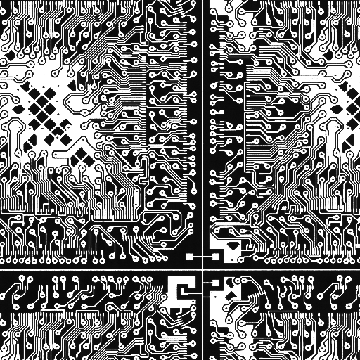
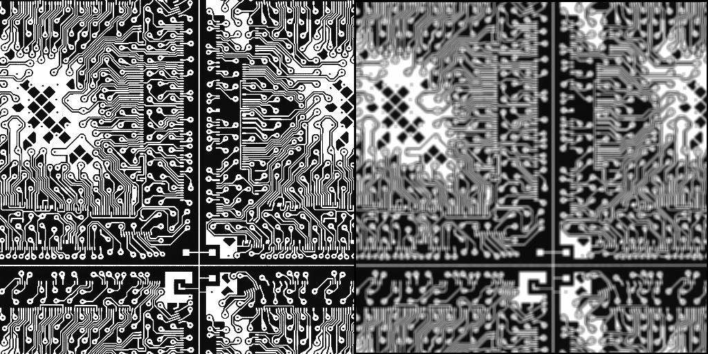
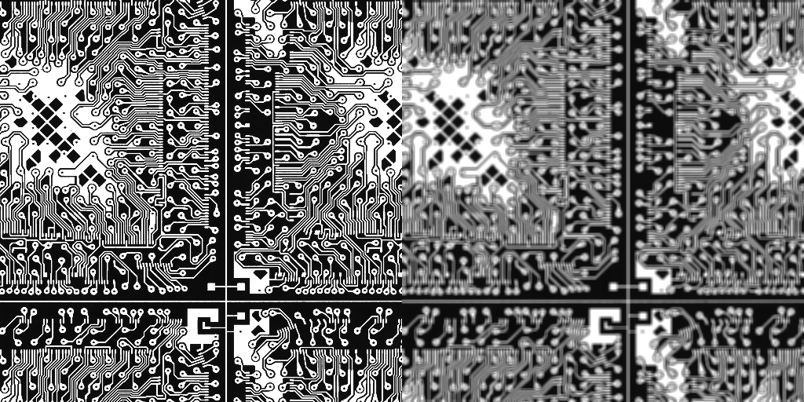

# INHA Univ. Parallel Image Processing Programming for Graduated Students HW7

## ./hw7

```
kana@Alienware:~/Documents/Class/Parallel image processing programming/hw7/build$ cmake . . && make && ./hw7
-- Configuring done
-- Generating done
-- Build files have been written to: /home/kana/Documents/Class/Parallel image processing programming/hw7/build
Consolidate compiler generated dependencies of target hw7
[ 33%] Building CXX object CMakeFiles/hw7.dir/src/hw7.cpp.o
[ 66%] Linking CXX executable hw7
[100%] Built target hw7

Parallel Image Processing Programming HW7
22212231 김가나

Gaussian Filtering Using Serial, OpenMP, OpenCV, IPP, CUDA
Image Size = 4096x4096, Kernel Size = 25x25 , Sigma Value = 25.0f

  |- Processing Time
   - Serial       : 30.9638 sec
   - OpenMP       : 4.22226 sec
   - OpenCV       : 0.013767 sec
   - IPP          : 0.055809 sec
   - CUDA         : 0.247995 sec
```

<p align="center">
  <p>Original</p>
  
  <p>Serial</p>
  
  <p>OpenMP</p>
  
  <p>OpenCV</p>
  
  <p>IPP</p>
  
  <p>CUDA</p>
  
</p>
