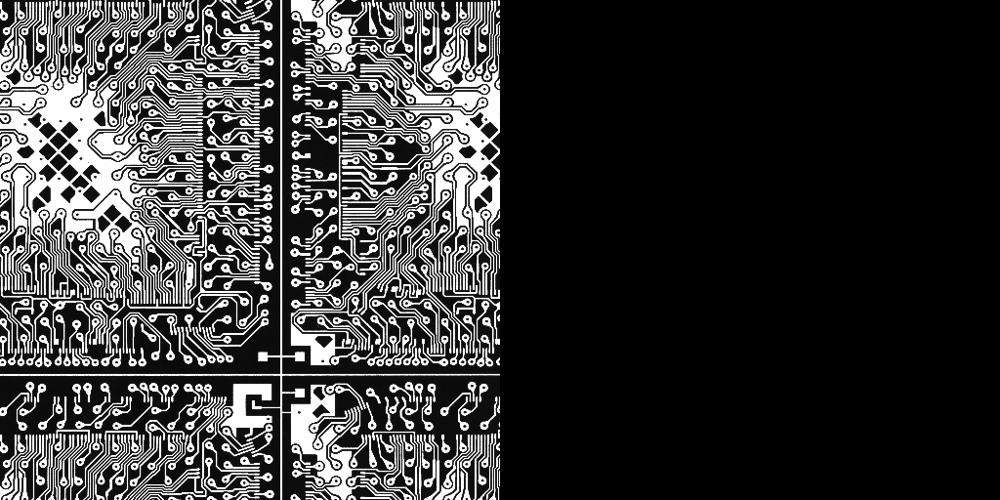

# INHA Univ. Parallel Image Processing Programming for Graduated Students HW7

## Now Fixing the CUDA Gaussian Filtering Error!!!!!!

## ./hw7

```
kana@Alienware:~/Documents/Class/Parallel image processing programming/hw7/build$ cmake .. && make && ./hw7
-- Configuring done
-- Generating done
-- Build files have been written to: /home/kana/Documents/Class/Parallel image processing programming/hw7/build
Consolidate compiler generated dependencies of target hw7
[ 33%] Building CXX object CMakeFiles/hw7.dir/src/hw7.cpp.o
[ 66%] Building CUDA object CMakeFiles/hw7.dir/src/kernel.cu.o
[100%] Linking CXX executable hw7
[100%] Built target hw7

Parallel Image Processing Programming HW7
22212231 김가나

5x5 Gaussian Filtering Using Serial, OpenMP, OpenCV, IPP, CUDA
Kernel Size = 5x5 , Sigma Value = 70.0f

  |- Processing Time
   - Serial       : 0.019709 sec
   - OpenMP       : 0.018384 sec
   - OpenCV       : 0.000422 sec
   - IPP          : 0.000387 sec
   - CUDA         : 0.371737 sec
```

<p align="center">
  
  
  
  
  
</p>
