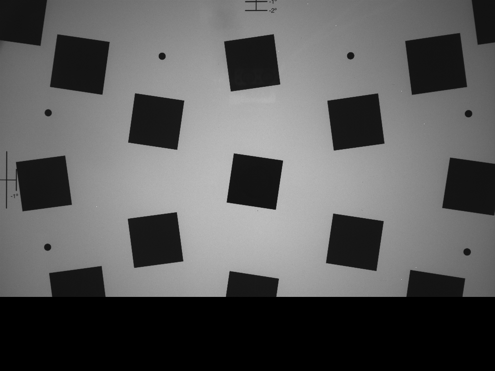
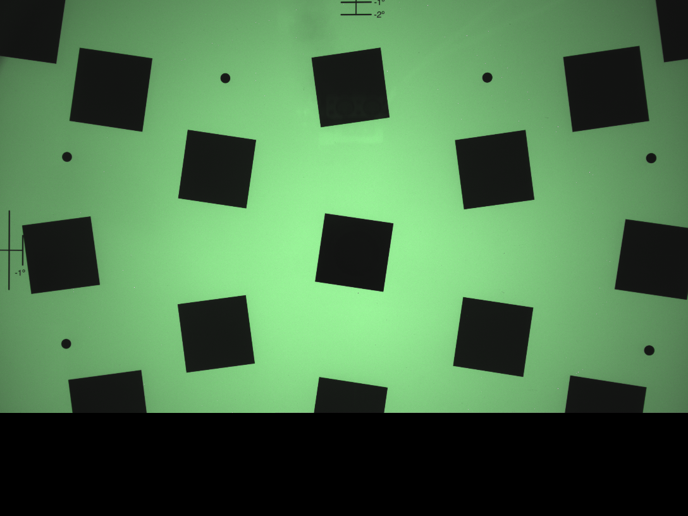

# INHA Univ. Parallel Image Processing Programming for Graduated Students Project1

## ./p1

```
kana@Alien
ware:~/Documents/Class/Parallel image processing programming/project1/build$ cmake .. && make && ./p1
-- Configuring done
-- Generating done
-- Build files have been written to: /home/kana/Documents/Class/Parallel image processing programming/project1/build
Consolidate compiler generated dependencies of target p1
[ 50%] Building CXX object CMakeFiles/p1.dir/src/p1.cpp.o
[100%] Linking CXX executable p1
[100%] Built target p1
Parallel Image Processing Programming Project1
22212231 김가나

Bayer Interpolation Using OpenMP & Comparesz with Serial
  |- Processing Time
     - Serial    : 0.387364 sec
     - OpenMP    : 0.256733 sec

```

<p align="center">
  
</p>
<p align="center">
  
</p>

<p align="center">
  
</p>
